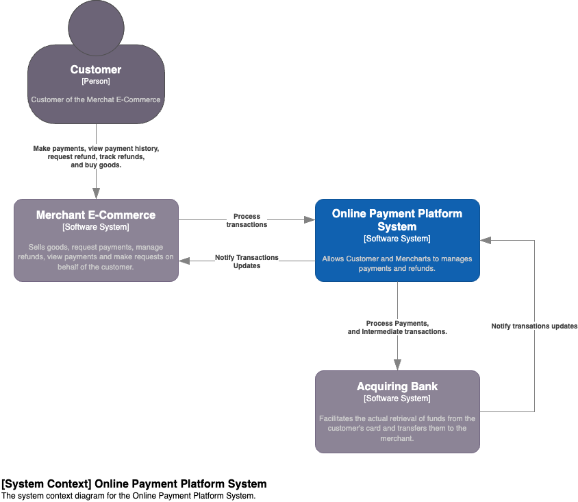
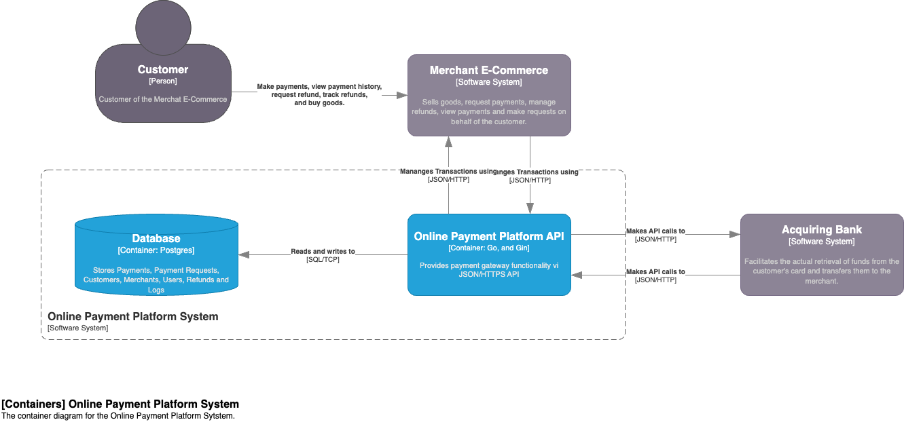

# Online Payment Platform: Architecture

## System Architecture

The system architecture is based on the following components:

- **Customer**: The customer is the user who wants to make a payment, view payment history, manage payment methods, etc. on the merchant's e-commerce platform.
- **Merchant**: The merchant is the e-commerce platform that provides the customer with the ability to make payments, view payment history, manage payment methods, etc.
- **Online Payment Platform System**: The online payment platform is the service that processes payments on behalf of the merchant. It is responsible for validating the customer's card information, processing the payment, and sending the payment details to the acquiring bank.
- **Acquiring Bank**: Facilitates the actual retrieval of funds from the customer's card and transfers them to the merchant. Additionally, it validates card information and sends payment details to the relevant processing organization.

In a real-world scenario, the acquiring bank would be a third-party service provider, but for the purpose of this project, it is simulated. Also we should use other services to send notifications, emails, etc.

Some operations should be managed by the `Customer` directly with the `Online Payment Platform` such as managing payment methods but for the purpose of this project, we are not going to implement this feature. Implementing will make the system more secure and reliable but there is not enough time to implement it.

Making the user to interact directly with the `Merchant` hides the complexity of the payment process and makes the system more user-friendly, also allows the `Merchant` to have more control over the payment process. This approach also enables multi-tenancy, using a `Merchant` as a tenant.

## Container Architecture

The system is composed of the following containers:

- **Online Payment Platform API**: The API is the entry point for the `Merchant` to interact with the `Online Payment Platform`. It is responsible for processing payment requests, managing payment methods, and sending notifications to the `Merchant`.
- **Database**: The database stores the payment details, payment methods, and other relevant information.

For real-world scenarios, we should implement:

- **Distributed Architecture**: The system should be distributed separating the concerns based on business domains using microservices, serverless or cell-based architectures.
- **Caching**: The system should use caching to improve performance and reduce the load on the database.
- **Message Queues**: The system should use message queues to decouple the components and improve reliability.
- **Monitoring and Logging**: The system should have monitoring and logging to track the system's health and performance.
- **Security**: The system should have security measures to protect the customer's card information and the merchant's data. This includes encryption, tokenization, and compliance with PCI DSS.
- **Load Balancing**: The system should use load balancing to distribute the load across multiple instances of the API.
- **API Gateway**: The system should use an API gateway to manage the API's traffic, security, and monitoring.
- **Third-Party Services**: The system should use third-party services to send notifications, emails, sms, etc.
