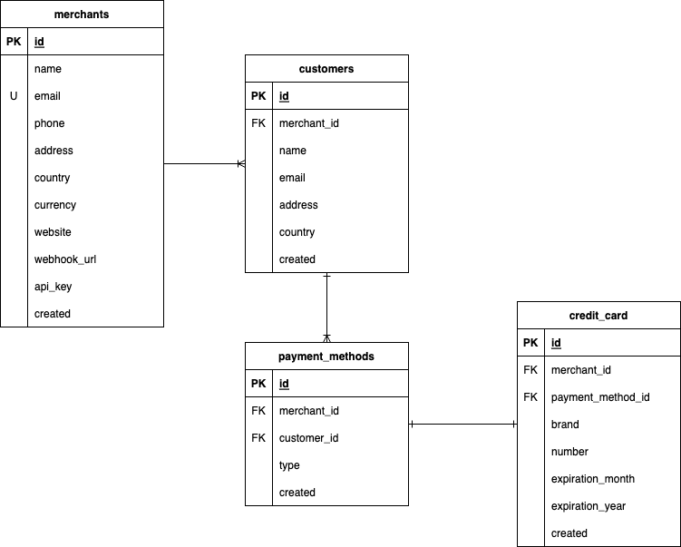

# Online Payment Platform: Database

This document describes the database schema for the online payment platform.

## Schema

The database schema consists of the following tables:

- `merchants`: Stores information about merchants. This table is the based for multi-tenancy.
- `customers`: Stores information about customers.
- `payments_methods`: Stores information about payment methods.
- `credit_cards`: Stores information about credit cards.
